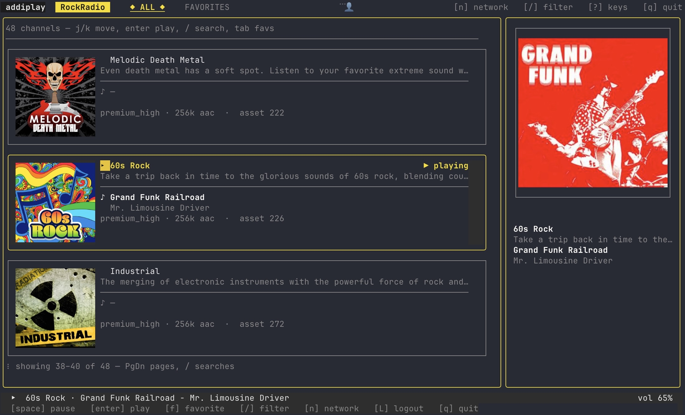
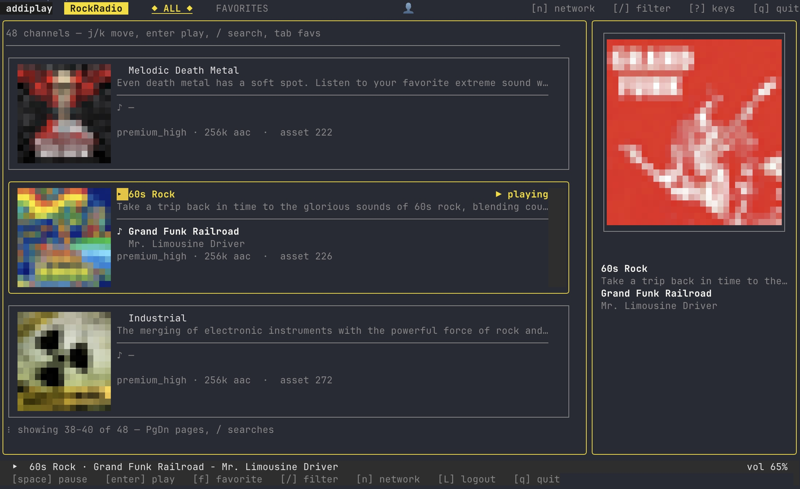

# addiplay

A small terminal music player for the [AudioAddict network](https://www.audioaddict.com/). Browse channels, see real album art inline, and stream from your terminal. Bring your own premium subscription.

<table>
  <tr>
    <td align="center"><strong>Ghostty / Kitty / WezTerm</strong><br/><sub>real raster album art</sub></td>
    <td align="center"><strong>Everywhere else (incl. tmux)</strong><br/><sub>pixelated ASCII half-block fallback</sub></td>
  </tr>
  <tr>
    <td></td>
    <td></td>
  </tr>
</table>

Channel and album art swap automatically based on what your terminal supports — nothing to tweak.

## Supported networks

addiplay covers every public AudioAddict network. Switch between them in the TUI with the network picker.

- **[DI.fm](https://www.di.fm/)** — electronic dance music (trance, house, techno, ambient, drum & bass, …)
- **[RadioTunes](https://www.radiotunes.com/)** — lounge, smooth jazz, indie, world music
- **[RockRadio](https://www.rockradio.com/)** — classic rock, alt, indie, metal, prog
- **[JazzRadio](https://www.jazzradio.com/)** — bebop, vocals, fusion, swing, smooth, latin
- **[ClassicalRadio](https://www.classicalradio.com/)** — symphonies, piano, opera, baroque, sacred
- **[ZenRadio](https://www.zenradio.com/)** — meditation, world fusion, new age, healing
- **FrescaTune** — light pop / variety

Each network ships dozens of curated channels. Press `n` to pick one.

## Install

### Homebrew (macOS / Linux)

```sh
brew install dimmkirr/tap/addiplay
```

`mpv` installs automatically as a dependency. Cask ships native binaries for macOS (Intel + Apple Silicon) and Linux (amd64 + arm64) — Homebrew picks the right one for your platform.

### Prebuilt binaries (Windows + manual installs)

Windows users (and anyone not using Homebrew) can grab archives from the [GitHub releases page](https://github.com/dimmkirr/addiplay/releases). Download, unpack, drop the binary on your `$PATH`. Install `mpv` separately (see [Dependencies](#dependencies)).

### From source

```sh
go install github.com/dimmkirr/addiplay@latest
# binary lands at $(go env GOBIN) or $(go env GOPATH)/bin
```

## Dependencies

**[mpv](https://mpv.io/installation/)** must be on your `$PATH` — addiplay shells out to mpv for the actual audio playback.

```sh
# macOS
brew install mpv

# Debian / Ubuntu
sudo apt install mpv

# Arch
sudo pacman -S mpv

# Fedora
sudo dnf install mpv
```

That's it. No display server, no GUI toolkit, no Python — just mpv and a terminal.

## Run

```sh
addiplay
```

First launch pops a login modal — enter the email + password for your AudioAddict account. The resulting session is saved to your OS keyring (Keychain on macOS, Secret Service on Linux, Wincred on Windows) and persists across runs.

If your system has no keyring, addiplay falls back to a chmod-600 file at `$XDG_CONFIG_HOME/addiplay/creds.json`.

## Hotkeys

While in the TUI:

| Key            | Action                                |
| -------------- | ------------------------------------- |
| `j` / `k`      | move up / down in channel list        |
| `↑` / `↓`      | same as `j` / `k`                     |
| `enter`        | play selected channel                 |
| `space`        | pause / resume                        |
| `+` / `-`      | volume up / down (5%)                 |
| `f`            | toggle favorite on the selected channel |
| `tab`          | switch tab (All ↔ Favorites)          |
| `/`            | filter channels by name               |
| `n`            | open the network picker               |
| `L`            | sign out (re-shows the sign-in modal) |
| `q`            | quit                                  |

## Configuration

Files live under `$XDG_CONFIG_HOME/addiplay/` (defaults to `~/.config/addiplay/` on Linux, `~/Library/Application Support/addiplay/` on macOS):

| File          | Purpose                                                                        |
| ------------- | ------------------------------------------------------------------------------ |
| `config.yml`  | last-played network/channel, volume, favorites per network                     |
| `creds.json`  | session fallback when no OS keyring is available (chmod 600)                   |

Nothing else writes to disk; uninstall is just removing the binary and (optionally) the config directory.

## Channel & album artwork

addiplay shows real channel and per-track album art in the right pane. The rendering technique is picked automatically based on your terminal — no flags to tweak.

### Kitty graphics protocol (best fidelity)

Real raster pixels. Smooth gradients, readable typography, true album-cover quality. Uses the [Kitty graphics protocol](https://sw.kovidgoyal.net/kitty/graphics-protocol/) — specifically the *Unicode placeholder* variant so the images compose cleanly inside the TUI's box layout without breaking alignment.

**Terminals that support it** (auto-detected):

| Terminal | macOS | Linux | Windows |
| -------- | :---: | :---: | :---: |
| [Ghostty](https://ghostty.org/) | ✅ | ✅ | — |
| [Kitty](https://sw.kovidgoyal.net/kitty/) | ✅ | ✅ | — |
| [WezTerm](https://wezfurlong.org/wezterm/) | ✅ | ✅ | ✅ |
| [Konsole](https://konsole.kde.org/) (KDE 22.04+) | — | ✅ | — |
| [Foot](https://codeberg.org/dnkl/foot) (Wayland) | — | ✅ | — |
| [Warp](https://www.warp.dev/) (recent builds) | ✅ | ✅ | — |
| [Black Box](https://gitlab.gnome.org/raggesilver/blackbox) | — | ✅ | — |

**Inside tmux:** Kitty escapes are stripped by tmux by default. addiplay detects this and falls back to ASCII automatically. If you've configured [tmux Kitty passthrough](https://sw.kovidgoyal.net/kitty/faq/#using-kitty-with-tmux), set `ADDIPLAY_FORCE_FANART=1` to bypass the detection.

### Truecolor ASCII half-blocks (fallback)

When Kitty graphics aren't available, addiplay renders the same images using colored `▀` characters. Works in any modern terminal that supports 24-bit color (most do — iTerm2, Apple Terminal, GNOME Terminal, Alacritty, VS Code's integrated terminal, etc.) and inside tmux on top of those. Pixelated by nature, but legible and consistent.

Run `addiplay --doctor` to see which mode was chosen and why.

## Other flags

```
addiplay --demo         # browse the UI with mock data — no creds, no network, no mpv
addiplay --doctor       # diagnose mpv / terminal / sign-in / network
addiplay --whoami       # print the signed-in account
addiplay --logout       # forget stored credentials
addiplay --version      # print version
```

Plus a handful of globals — combine with any of the above:

| Flag                 | Effect                                                              |
| -------------------- | ------------------------------------------------------------------- |
| `--debug`            | write detailed log to `--debug-log` (mpv + internal events)         |
| `--debug-log <path>` | path for `--debug` output (default `./debug.log`)                   |
| `--ascii`            | force ASCII artwork even on Kitty-capable terminals                 |
| `-v`, `--verbose`    | verbose output                                                      |

## Troubleshooting

| Symptom                                              | Fix                                                                  |
| ---------------------------------------------------- | -------------------------------------------------------------------- |
| `mpv binary not found in PATH`                       | install mpv (see [Dependencies](#dependencies))                      |
| Sign-in fails on a Google/Facebook-linked account    | set an email+password at https://www.audioaddict.com/account, retry  |
| Login modal keeps popping up                         | keyring access denied — check `creds.json` fallback permissions      |
| Album art doesn't render                             | `addiplay --doctor` will tell you why                                |
| Anything else                                        | `addiplay --debug --debug-log /tmp/adp.log`, then `tail -f /tmp/adp.log` |

## Development

```sh
git clone https://github.com/dimmkirr/addiplay
cd addiplay
go test ./...
go build -o ./bin/addiplay .
./bin/addiplay --demo
```

## License

MIT — see [`LICENSE`](LICENSE).
